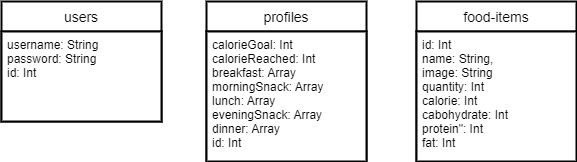

# **Fitness Friend**

Fitness friend is an web application that helps to calculate and track calories of the day.

- It has an calorie calculator which helps user to find their calorie target based on their diet goal.
- It has an tracker with an calorie counter which changed based on the added or removed food items of their respective calorie content.
- It has an search page where users can find the food items they want to add to the tracker.

### Technologies and Frameworks

- It is developed using _React JS_, _CSS_, _Bootstrap_, _React-Bootstrap_.
- Json is used to store and manipulate the application data.

### Components

- App - The parent component for all. Maintains the application state and contains number of methods for the app’s functionality. It is Configured with routes.​

- Login - It have the markup for the login page and maintains the state of login form.​

- SignUp - It have the markup for the Sign up page and maintains the state of sign up form.​

- Dashboard - It is the layout components which has header, side navigation bar, render tracker or health-calculator or search-page based on the route path. ​

- Tracker - It has the markup for tracker and a form which takes user’s calorie target for the day. It contains all the food items under its respective meal category.​

- Health-calculator - It helps the user to find their BMI, BMR, Target Calorie, Target Macro Nutrients.​

- Search- It provide the food items that user wants to add to the tracker. ​

### Routes

- Login - `http://localhost:3000/login​`

- SignUp - `http://localhost:3000/sign-up​`

- Tracker - `http://localhost:3000/dashboard/tracker​`

- Health Calculator - `http://localhost:3000/dashboard/health-calculator​`

- Search - `http://localhost:3000/dashboard/search-item​`

### Json server endpoints

- `http://localhost:8000/food-items`​

- `http://localhost:8000/users​`

- `http://localhost:8000/profiles​`

### Application Flow

### Json data design

### Application Screenshots

.png>)

 <b>Login page</b> 

.png>)

 <b>Signup Page</b> 

.png>)

 <b>Login page. Invalid Credentials</b> 

.png>)

 <b>Signup Page. Account not created</b> 

.png>)

 <b>Signup Page. Account created</b> 

.png>)

 <b>Tacker form</b> 

.png>)

 <b>Tracker</b> 

.png>)

 <b>Search page</b> 

.png>)

 <b>Tracker</b> 

.png>)

 <b>Tracker</b> 

.png>)

 <b>Calorie Calculator</b> 

.png>)

 <b>Calorie Calculator result</b> 

### Clone project

`git clone https://github.com/pragadesh-k/fitness-friend.git`

### Install Dependencies

`npm install`

### Setup Json Server

1. `npm install -g json-server`
2. `json-server --watch data/db.json --port 8000`

### `npm start`

Runs the app in the development mode.\
Open [http://localhost:3000](http://localhost:3000) to view it in the browser.

The page will reload if you make edits.\
You will also see any lint errors in the console.

### `npm test`

Launches the test runner in the interactive watch mode.\
See the section about [running tests](https://facebook.github.io/create-react-app/docs/running-tests) for more information.

### `npm run build`

Builds the app for production to the `build` folder.\
It correctly bundles React in production mode and optimizes the build for the best performance.

The build is minified and the filenames include the hashes.\
Your app is ready to be deployed!

See the section about [deployment](https://facebook.github.io/create-react-app/docs/deployment) for more information.

### `npm run eject`

**Note: this is a one-way operation. Once you `eject`, you can’t go back!**

If you aren’t satisfied with the build tool and configuration choices, you can `eject` at any time. This command will remove the single build dependency from your project.

Instead, it will copy all the configuration files and the transitive dependencies (webpack, Babel, ESLint, etc) right into your project so you have full control over them. All of the commands except `eject` will still work, but they will point to the copied scripts so you can tweak them. At this point you’re on your own.

You don’t have to ever use `eject`. The curated feature set is suitable for small and middle deployments, and you shouldn’t feel obligated to use this feature. However we understand that this tool wouldn’t be useful if you couldn’t customize it when you are ready for it.

<h3 style="text-align:center">Thank you.</h3>
